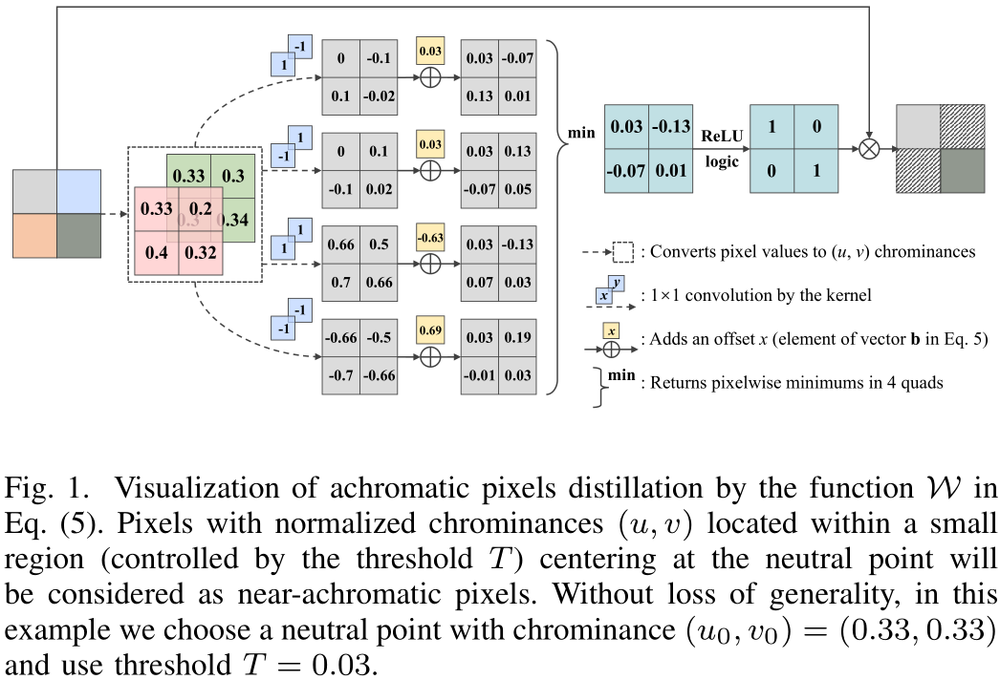
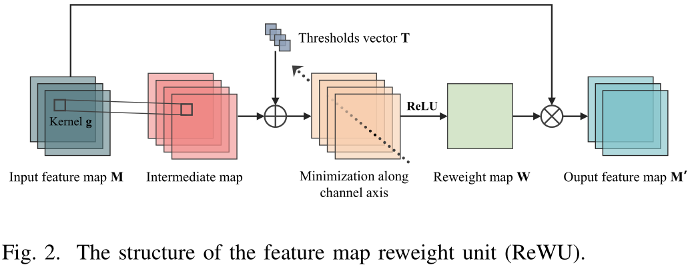
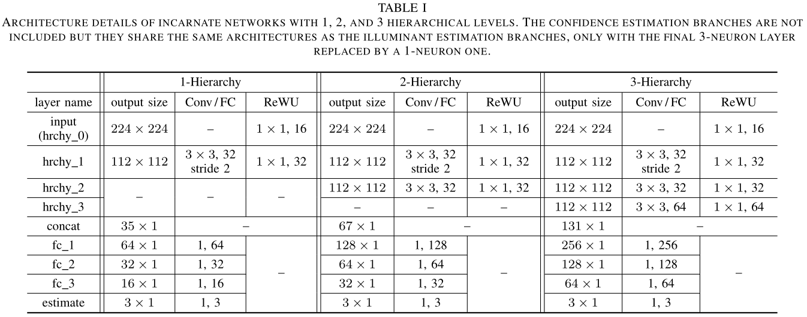
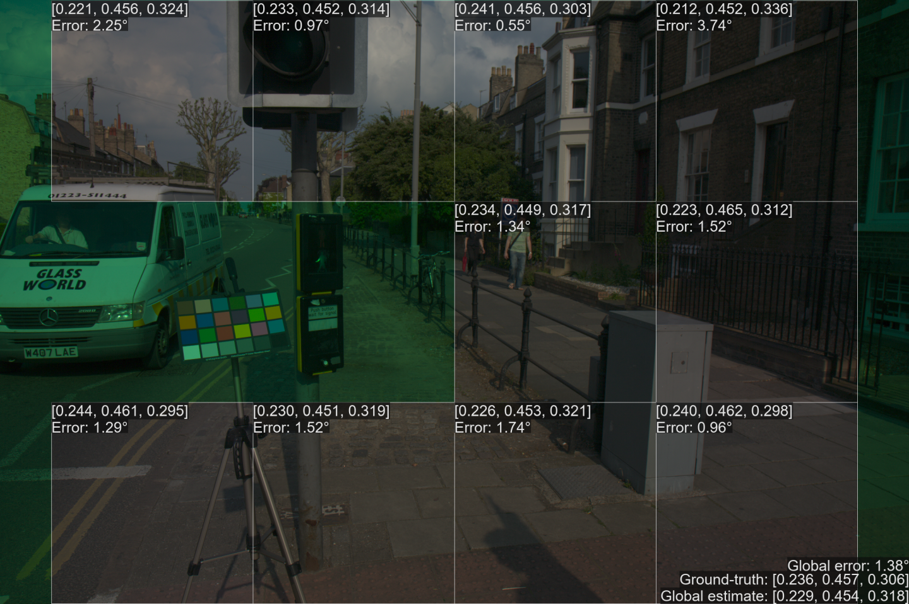
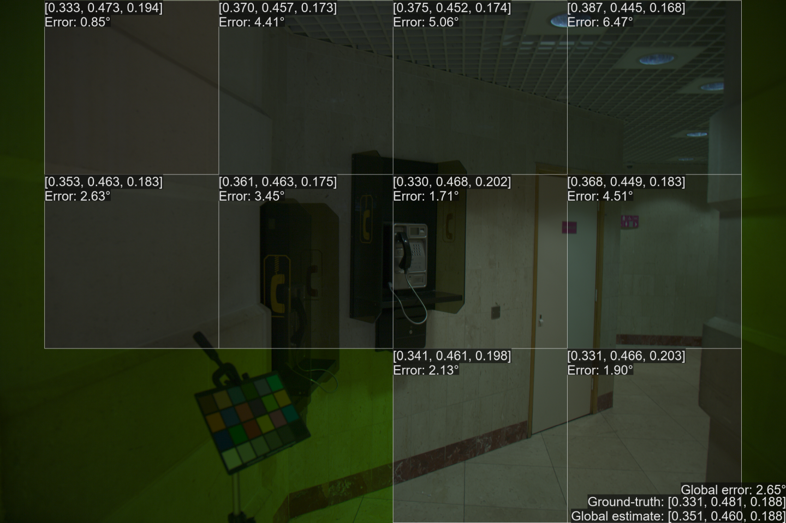
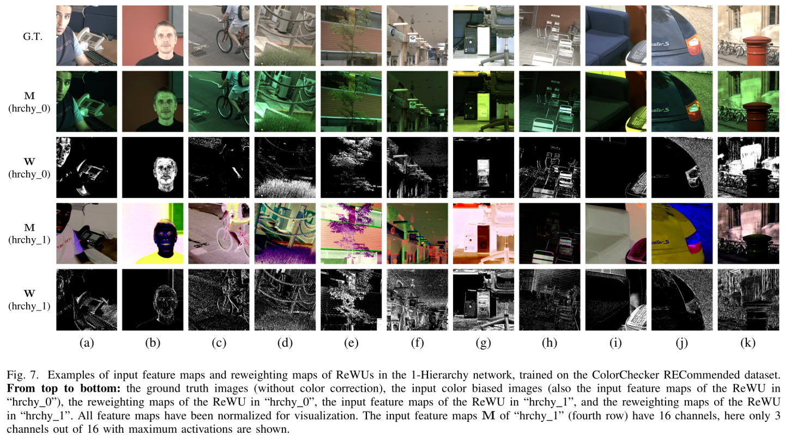
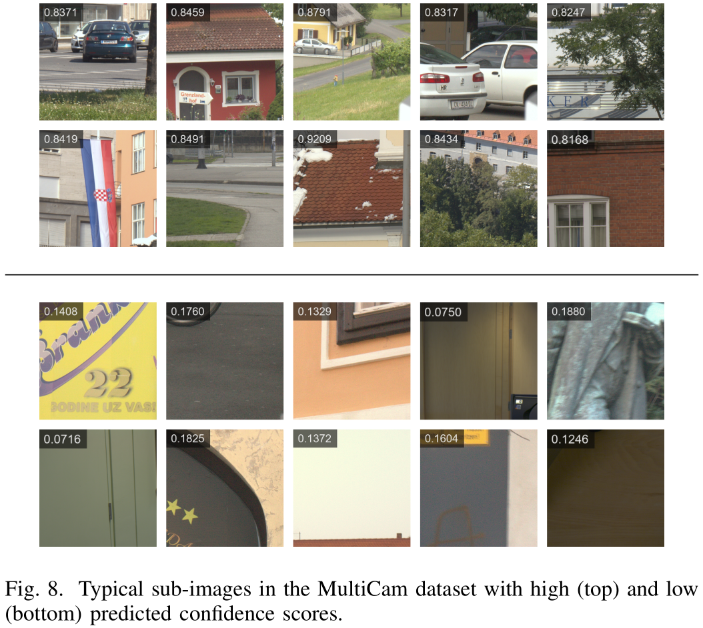

# Color Constancy by Reweighting Image Feature Maps

This repository provides codes, pre-trained models, and dataset to implement illuminant estimation algorithm proposed in paper *[Color Constancy by Reweighting Image Feature Maps](https://arxiv.org/abs/1806.09248)*. One can evaluate models' performances on benchmark datasets, or even make inference on color-biased images downloaded from the Internet.


# TL;DR

1. (optional) Add some images to `.\sample_images\Flickr\`.
2. Run `python cc.py -s 1 -g .\sample_images\Flickr\*`.
3. Check the outputs in `.\sample_images\Flickr\white_balanced_images\`.


# Introduction

The restricted computational color constancy is equivalent to illuminant color estimation problem. In this paper we proposed the **feature map reweight unit (ReWU)** to address this problem in an efficient and interpretable way. ReWU incorporates the high representational capacity of convolutional models as well as the great interpretability of statistics-based models, and helps achieve competitive accuracies on benchmark datasets with respect to prior state-of-the-art algorithms with only 1%~5% model size and 8%~20% computational cost. 




<br>



<br>


> **Top row:** ReWU in the input layer (hrchy_0). **Bottom row:** ReWU in the first conv layer (hrchy_1).  
> **From left to right:** the input feature maps, the reweighting maps, and the output feature maps.  
> Brighter pixels in the middle images have stronger impact on inferring the illuminant color. Tested with model `.\pretrained_models\MultiCam\Hierarchy-1.h5`.

More animations can be found [here](figures/comparison.gif) and [here](figures/local_estimates.gif) (~40MB each).

<br>

Besides the point estimates (illuminant color estimates), we also added a **confidence estimation branch** to the network such that the predictive uncertainties of the illuminant color estimates can be quantified, which provides useful clues for local estimates aggregation or multiple illumination estimation. In paper [Learning Confidence for Out-of-distribution Detection in Neural Networks](https://arxiv.org/abs/1802.04865), a good example was given to demonstrate the purpose of designing such a branch:

> Imagine a test writing scenario. For this particular test, the student is given the option to ask for hints, but for each hint they receive, they also incur some small penalty. In order to optimize their score on the test, a good strategy would be to answer all of the questions that they are confident in without using the hints, and then to ask for hints to the questions that they are uncertain about in order to improve their chances of answering them correctly. At the end of the test, their level of confidence for each question can be approximated by counting the number of hints used. Applying this same strategy to neural networks gives 

Here is the final architecture of our model:

<br>


<br>

We provide pre-trained models with and without the confidence estimation branch.

The number of the hierarchical levels (the number of the blue Convolution blocks) can be flexibly chosen. In this repository we publish three types of network architecture: 1-Hierarchy, 2-Hierarchy, and 3-Hierarchy:

<br>




# Pre-trained models

Currently we publish models pre-trained on two dataset: the ColorChecker RECommended dataset and the MultiCam dataset.

## ColorChecker RECommended dataset

The ColorChecker RECommended dataset is an updated version of the original [Gehler-Shi dataset](http://www.cs.sfu.ca/~colour/data/shi_gehler/), which re-generates a new "recommended" ground-truth set. See [this link](http://colorconstancy.com/?page_id=21#colorcheckerhemrit) for more details about this dataset.

Images in the ColorChecker RECommended dataset are device-dependent, you should not expect the networks trained on this dataset would have good generalization on other datasets. In the Q&A we will discuss how to evaluate the estimation accuracies on this dataset.

## MultiCam dataset

The MultiCam dataset contains over 3,000 full-resolution images from 11 camera models:

* Canon 1D
* Canon 1Ds MkIII
* Canon 5D
* Canon 550D
* Canon 600D
* Fujifilm XM1
* Nikon D5200
* Olympus EPL6
* Panasonic GX1
* Samsung NX2000
* Sony A57

In this list, Canon 1D and Canon 5D were collected from the ColorChecker RECommended dataset, Canon 550D was from the [Cube dataset](https://ipg.fer.hr/ipg/resources/color_constancy), and the rest were from [NUS-8 Camera dataset](http://cvil.eecs.yorku.ca/projects/public_html/illuminant/illuminant.html).

Different photosensors record quite distinct pixel values given the same scenes. To produce device-independent image signals, we used 3\*3 color correction matrices provided by [Dcraw](https://www.cybercom.net/~dcoffin/dcraw/) to convert raw images from camera color spaces into the standard linear sRGB color space for each camera model. Other implementations and the data augmentation can be found in the paper.

Since images in the MultiCam dataset are device-independent, the models trained on this dataset are also applicable to images in a wide variety that have gone through other post-processings. Feel free to use models trained on this dataset to make inference on images from other resources. The MultiCam dataset is available <a name="MultiCamLink">[here](https://1drv.ms/f/s!AniPeh_FlASDhG7QE6PJiy6s-RlE)</a>.


# Visualization


<br>



<br>



<br>



<br>




# Usage

## Dependencies 

The project was tested in Python 3. Run `pip install -r requirements.txt` to install dependent packages.

## Inference

Basic usage: 
```
python cc.py img_dir
```
Optional usages:

* `-d/--dataset {'M', 'R'}`: select pre-trained model for MultiCam dataset or ColorChecker RECommended dataset.
* `-l/--level {1, 3}`: select how many hierarchical levels to utilize.
* `-c/--confidence`: use network with the confidence estimation branch.
* `-g/--gamma`: apply the inverse gamma correction to the (non-linear) input image(s). Turn on this option only if the input image(s) has gone through gamma post-processing.
* `-s/--save {0-4}`: visualization option. Use `-s 4` to save all visualization figures, or use `-s 1` to save only the white-balanced images.
* `-r/--record`: turn on this option to write results into a text file.
* `-b/--batch N`: manually set the batch size to N. The default is 64. Decrease it if encounter memory allocations issue.

Don't forget to use `python cc.py -h` to print more help messages.

When a text file named `ground-truth.txt` is detected in the same directory of the test images, the *evaluation mode* would be automatically activated, in which angular errors between the estimates and the ground-truth would be calculated. A template of `ground-truth.txt` can be found [here](sample_images/RECommended/ground-truth.txt).

You can also place a `masks.txt` file in the the same directory of the test images, in which the coordinates of the masking polygons are given. In making inference, image regions located within these masks will be excluded. A template of `masks.txt` can be found [here](sample_images/RECommended/masks.txt).

**Note I:** when option `-s 3` or `-s 4` is selected, the masked regions declared by `masks.txt` (if exists) in the intermediate feature maps will NOT be blacked out for better visualization. However, these regions had indeed been excluded when making inference.

**Note II:** the training images in the MultiCam dataset do not include nighttime scenes, so feeding nighttime images into the model may produce poor results.

## Training

For the sake of simplicity, we currently only publish the routine for training *naive* network(s). Taking the ColorChecker RECommended dataset for example:

1. Download the raw images [here](http://www.cs.sfu.ca/~colour/data/shi_gehler/) and unzip it to `.\sample_images\RECommended\` directory.

2. Download our pre-processed sub-images [here](https://1drv.ms/u/s!AniPeh_FlASDhUclWQ48Pm2DYkOX) and unzip it to `.\train\RECommended\imdb\` directory. Data augmentation had been done as described in the section IV-C of the paper.

3. Run `python train.py` and wait for it to finish (may take hours or days, depending on your machine specs). Use option `-l/--level {1, 2, 3}` to select how many hierarchical levels to utilize. Type in `python train.py -h` for more help messages.

4. Run `python cvmerge.py .\train\RECommended\models\Hierarchy-X` to merge statistics from 3 folds of cross validation, where `X` is the hierarchical levels.

**Note I:** we have provided trained models in the subdirectories. Feel free to run `cvmerge.py` directly, which can help save much of your time. Delete all subdirectories in `.\train\RECommended\models\` before training your own models.

**Note II:** remember to use the labels provided by the ColorChecker RECommended dataset `.\sample_images\RECommended\ground-truth.txt` instead of those by Gehler-Shi dataset.

**Note III:** we did not fix the random seeds during experiments. Try to train several times and you may get better result.


# Q&A

***Q1:***  Which ground-truth sets did you use?

***A1:***

* The ground-truth for the ColorChecker RECommended dataset is available [here](http://colorconstancy.com/wp-content/uploads/2018/09/groundtruthcoordinates.zip).
* The ground-truth for the NUS-8 Camera dataset is available [here](http://cvil.eecs.yorku.ca/projects/public_html/illuminant/illuminant.html).
* The ground-truth for the MultiCam dataset is included in the [zip](#MultiCamLink).

You can also find these files in the `.\sample_images\` directory.

<br>

***Q2:***  How to test the models on the ColorChecker RECommended dataset?

***A2:***  We have provided several sample images in the `.\sample_images\RECommended\` directory. Just use

```
python cc.py -d R -c -s 4 -r .\sample_images\RECommended\*.png
```
to make inference on these sample images.

<br>

***Q3:***  How to test the models on the MultiCam dataset?

***A3:***  Same as A2. Try

```
python cc.py -s 4 -r .\sample_images\MultiCam\*
```

As mentioned above, you can also use these models to make inference on images outside the MultiCam dataset, e.g., those downloaded from Flickr.com:
```
python cc.py -s 1 -g .\sample_images\Flickr\*
```

(Please note that producing intermediate feature maps with `-s 3`  or `-s 4` may take a long time.)

<br>

***Q4:***  What's the space and time complexities of your models?

***A4:***  The numbers of model parameters and operations (multiply-adds) in one forward propagation are listed below, assuming the input images have fixed sizes of 224\*224 (without/with conf. est.):

|         |    1-Hierarchy     |    2-Hierarchy     |    3-Hierarchy     |
| :-----: | :----------------: | :----------------: | :----------------: |
| #Params |    7.6K / 13.0K    |   32.7K / 52.7K    |  112.6K / 189.4K   |
|  #Ops   | 5.9×10<sup>7</sup> | 1.9×10<sup>8</sup> | 4.7×10<sup>8</sup> |

We also tested our models on two PCs, here is the average inference time per image (without/with conf. est.):

|      | 1-Hierarchy | 2-Hierarchy | 3-Hierarchy |
| :--: | :---------: | :---------: | :---------: |
| PC1  | 40ms / 41ms | 43ms / 43ms | 47ms / 48ms |
| PC2  | 35ms / 35ms | 42ms /43ms  | 50ms / 51ms |
> Image read and pre-processings time is NOT included  
> PC1: Intel i5-3470 3.2GHz CPU + Nvidia 1080-Ti GPU + HDD  
> PC2: AMD Ryzen7 1700 3.0GHz CPU + Nvidia 1060 GPU + SSD

<br>

***Q5:*** Is it possible to get the results improved?

***A5:*** Very likely. In fact we did not spend much time tuning the models, e.g., the number of kernels in each layer, the initializers of the FC layers, the learning rate, the choice of optimizer, ... You may expect to get better results by appropriately tuning these hyperparameters. Besides, generating training data on-the-fly is also a good choice to improve the robustness of models, as done in [FC4](https://github.com/yuanming-hu/fc4).


# BibTeX

```
@article{Qiu:2018,
  author    = {Jueqin Qiu and Haisong Xu and Zhengnan Ye},
  title     = {Color Constancy by Reweighting Image Feature Maps},
  journal   = {CoRR},
  volume    = {abs/1806.09248},
  year      = {2018},
  url       = {http://arxiv.org/abs/1806.09248}
}
```


# Acknowledgments

Thank [Prof. Nikola Banić](https://ipg.fer.hr/ipg/people/nikola_banic?) and [@yuanming-hu](https://github.com/yuanming-hu) for their kind advices during this project.
